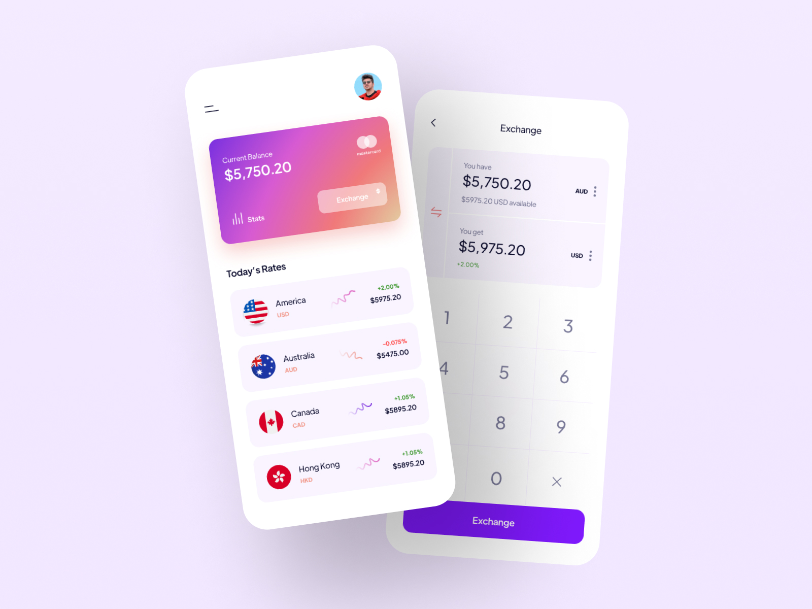

<h1 align="center">Currency Converter</h1>

An intuitive and visually appealing iOS currency conversion app, as our first iOS app project, inspired by the UI design from rhagency

---
 
**Note:**
- The app features currencies of 10 countries and 2 cryptocurrencies, ₿TC and ΞTH.
- Rates are updated daily.
- Sourced from fawazahmed0's currency-api.

This project is solely made for our practice in iOS development and is not intended as a product for the general public.

